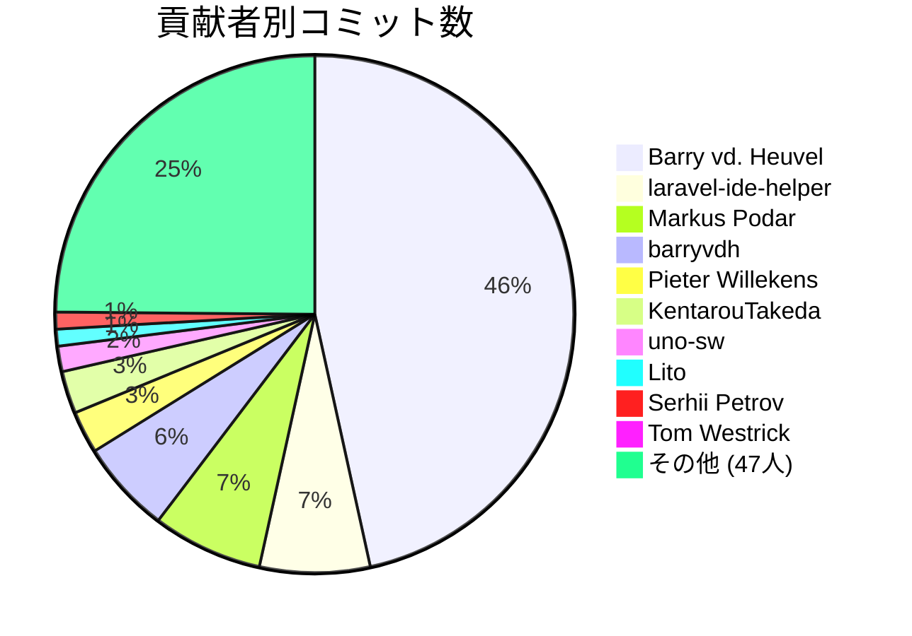

# laravel プロジェクト開発レポート

## 概要

- 期間: 2023-11 から 2025-03
- 総コミット数: 190
- 総追加行数: 121794
- 総削除行数: 72100
- 貢献者数: 57

## 貢献者

| 貢献者 | コミット数 | 追加行数 | 削除行数 |
| --- | ---: | ---: | ---: |
| Barry vd. Heuvel | 88 | 117088 | 70037 |
| laravel-ide-helper | 13 | 127 | 135 |
| Markus Podar | 13 | 176 | 301 |
| barryvdh | 11 | 0 | 0 |
| Pieter Willekens | 5 | 294 | 9 |
| KentarouTakeda | 5 | 1374 | 1353 |
| uno-sw | 3 | 85 | 36 |
| Lito | 2 | 5 | 3 |
| Serhii Petrov | 2 | 4 | 4 |
| Tom Westrick | 1 | 2 | 2 |
| Jonny Nott | 1 | 2 | 2 |
| yparitcher | 1 | 1 | 1 |
| skyler544 | 1 | 4 | 0 |
| Kristijan | 1 | 1 | 1 |
| Casper Bloemendaal | 1 | 5 | 1 |
| Jesper Noordsij | 1 | 0 | 0 |
| Mathieu TUDISCO | 1 | 34 | 32 |
| Nereo Berardozzi | 1 | 88 | 15 |
| Martin Tillmann | 1 | 0 | 0 |
| hms5232 | 1 | 0 | 0 |
| Lau Ernebjerg Josefsen | 1 | 13 | 13 |
| Yifans_Z | 1 | 6 | 3 |
| Jeppe Knockaert | 1 | 4 | 4 |
| Bob Conan | 1 | 0 | 0 |
| Carl-Philipp Jung | 1 | 135 | 23 |
| Jeramy Hing | 1 | 311 | 1 |
| Ramon Dantas | 1 | 3 | 1 |
| erikn69 | 1 | 0 | 0 |
| khaled sadek | 1 | 3 | 0 |
| schrosis | 1 | 1 | 1 |
| Bram | 1 | 25 | 1 |
| michal | 1 | 131 | 1 |
| Braunson Yager | 1 | 11 | 0 |
| Benedikt Franke | 1 | 25 | 25 |
| stefanScrumble | 1 | 456 | 30 |
| pb30 | 1 | 2 | 2 |
| sforward | 1 | 244 | 3 |
| dev2a | 1 | 106 | 0 |
| GeoSot | 1 | 5 | 2 |
| Menthol | 1 | 85 | 4 |
| Hans van Luttikhuizen-Ross | 1 | 192 | 28 |
| Norman Huth | 1 | 1 | 1 |
| Caleb White | 1 | 116 | 5 |
| Sven | 1 | 1 | 0 |
| Ben Poulson | 1 | 4 | 0 |
| leo108 | 1 | 8 | 3 |
| James Bhatta | 1 | 0 | 0 |
| Filip Iulian Pacurar | 1 | 191 | 0 |
| snmatsui | 1 | 1 | 0 |
| Ruben Robles | 1 | 239 | 1 |
| Allan Laal | 1 | 0 | 0 |
| PapaBear | 1 | 5 | 0 |
| netpok | 1 | 14 | 14 |
| Jackey Cheung | 1 | 3 | 0 |
| Toby Twigger | 1 | 0 | 0 |
| Oleksandr Oliinyk | 1 | 161 | 0 |
| dependabot[bot] | 1 | 2 | 2 |

## 月別活動

| 月 | コミット数 | 追加行数 | 削除行数 |
| --- | ---: | ---: | ---: |
| 2023-11 | 1 | 2 | 2 |
| 2023-12 | 0 | 0 | 0 |
| 2024-01 | 1 | 8 | 3 |
| 2024-02 | 64 | 2824 | 1842 |
| 2024-03 | 2 | 106 | 0 |
| 2024-04 | 1 | 244 | 3 |
| 2024-05 | 0 | 0 | 0 |
| 2024-06 | 2 | 15 | 7 |
| 2024-07 | 12 | 651 | 58 |
| 2024-08 | 4 | 88 | 36 |
| 2024-09 | 1 | 0 | 0 |
| 2024-10 | 25 | 2135 | 1416 |
| 2024-11 | 1 | 0 | 0 |
| 2024-12 | 42 | 115526 | 68665 |
| 2025-01 | 26 | 144 | 59 |
| 2025-02 | 7 | 49 | 7 |
| 2025-03 | 0 | 0 | 0 |

## コミット数の推移

```mermaid
line chart
    title コミット数の推移
    x-axis ["2023-11", "2023-12", "2024-01", "2024-02", "2024-03", "2024-04", "2024-05", "2024-06", "2024-07", "2024-08", "2024-09", "2024-10", "2024-11", "2024-12", "2025-01", "2025-02", "2025-03"]
    y-axis "コミット数"
    line [1, 0, 1, 64, 2, 1, 0, 2, 12, 4, 1, 25, 1, 42, 26, 7, 0]
```

## 追加・削除行数の推移

```mermaid
line chart
    title 追加・削除行数の推移
    x-axis ["2023-11", "2023-12", "2024-01", "2024-02", "2024-03", "2024-04", "2024-05", "2024-06", "2024-07", "2024-08", "2024-09", "2024-10", "2024-11", "2024-12", "2025-01", "2025-02", "2025-03"]
    y-axis "行数"
    line "追加行数" [2, 0, 8, 2824, 106, 244, 0, 15, 651, 88, 0, 2135, 0, 115526, 144, 49, 0]
    line "削除行数" [2, 0, 3, 1842, 0, 3, 0, 7, 58, 36, 0, 1416, 0, 68665, 59, 7, 0]
```

## 貢献者別コミット数



